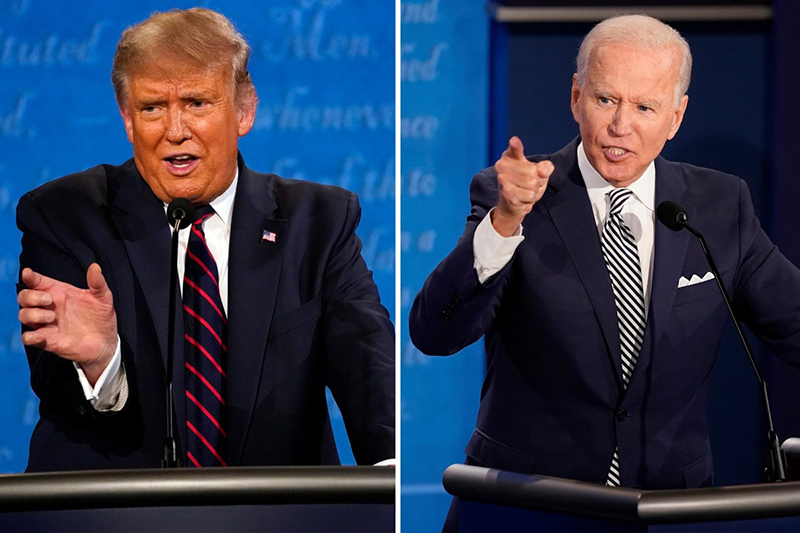

# Commission Cancels Second Debate between Trump and Biden

On Friday, October 9 the Commission on Presidential Debates **canceled the second debate between President Trump and Vice-President Biden** after Donald Trump **refused to do a virtual debate** after he was tested **positive for Covid-19**. The commission said in a statement:
> It is now apparent there will be no debate on October 15, and the CPD will turn its attention to preparations for the final presidential debate scheduled for October 22.  

[This news](https://edition.cnn.com/2020/10/09/politics/second-presidential-debate-canceled/index.html) is important because it could *potentially influence the result of the election*. Personally, because the foreign policy form Joe Biden is very different from what Donald Trump has to offer, the election could *influence international students like me who want to study in the U.S*.

[This photo](https://bangordailynews.com/2020/09/29/national-politics/first-presidential-debate-erupts-in-angry-interruptions-and-bitter-exchanges/) captured one of the intense moments in the first presidential debate:  

Additional Information:
* Second Presidential Debate Canceled [but Trump Plans In-person Events](https://www.theguardian.com/us-news/2020/oct/09/trump-biden-debate-canceled-rally)
* What To Know about [The 2020 Presidential Debates](https://www.washingtonpost.com/elections/2020/08/14/presidential-debates/)
* 2020 Election Presidential Debate Calendar: [Key Dates](https://www.nytimes.com/2020/10/10/us/politics/presidential-debate-calendar.html)
